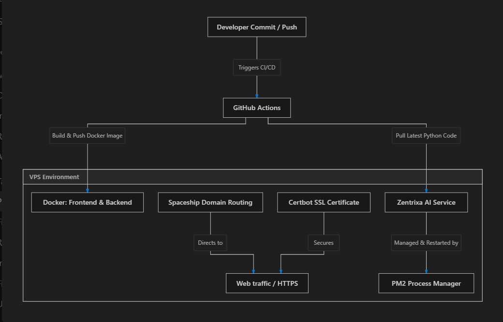

This project was created as part of an assessment submission for Ethara AI.
Unauthorized copying, redistribution, or commercial use is not permitted without permission.

# Tickzen — Team Task Manager

A full-stack web application for managing projects, assigning tasks, and tracking team progress — with role-based access control for **Admins** and **Members**.

---

## 🌐 Live Demo

- 🔗 **Live App:** https://tickzen.in.net/
- 📹 **Demo Video:** https://drive.google.com/file/d/18cxzOS7xOSfi27Fx_dhTrRoJnwWL2157/view?usp=drive_link
- 💻 **GitHub Repository:** https://github.com/PROTOX11/Task_manager

---

## 📌 Features

### 🔐 Authentication & Onboarding

- **JWT-Based Authentication**: Secure stateless login sessions with password hashing.
- **OTP Verification (via Brevo)**: 6-digit email OTPs to verify user signups and logins.
- **Social Login (Google OAuth 2.0)**: Quick login/signup integration with Google accounts.
- **Premium Admin Tier (via Razorpay)**: Secured payment portal allowing developers to buy or upgrade to admin packages.
- **30-Minute Trial Admin Pass**: Sandbox style admin evaluation periods.

### 👥 Role-Based Access Control

- **Admin**
  - Create and manage projects
  - Manage team members
  - Assign tasks and update statuses
  - Delete resources and view administrative logs
- **Member**
  - View assigned tasks
  - Update task status and add comments
  - Track personal and project progress

### 📁 Project & Task Management

- Create, update, and delete projects
- Invite and manage project developers
- Create tasks, specify priorities, due dates, and attach files
- Project status boards and task flow controls (`To Do` ➔ `In Progress` ➔ `Done`)

### 🧠 Zentrixa AI Assistant

- **Voice Command Transcription (via AssemblyAI)**: Stream audio task descriptions straight to the server to get them transcribed.
- **LLM Command Parsing (via OpenAI/OpenRouter)**: Feed transcription/text commands into a configured LLM to generate precise JSON actions (e.g., automatically creating a task, assigning a developer, or changing task statuses).

### 📊 Dashboard

- Task breakdown graphs and progress tracking
- Highlights for overdue tasks and priority levels
- Quick filters by project, status, or assignee

---

## ⚙️ Tech Stack & Integrations

| Layer / Integration    | Technology / API                                    |
| :--------------------- | :-------------------------------------------------- |
| **Frontend**           | **Next.js** + Tailwind CSS + GSAP + SWR             |
| **Backend**            | Node.js + Express.js + Socket.io                    |
| **Database**           | MongoDB (via Mongoose ODM)                          |
| **Email Service**      | **Brevo (Sendinblue)** for Transactional OTP Emails |
| **Authentication**     | **Google OAuth 2.0** (`google-auth-library`)        |
| **Payment Gateway**    | **Razorpay** SDK                                    |
| **Voice Processing**   | **AssemblyAI** (WebM Audio Transcriptions)          |
| **AI Command Parsing** | **OpenAI API / OpenRouter** (LLM Prompting Engine)  |
| **Deployment**         | Railway (or Docker-compose orchestrations)          |

---

## 🗄️ Database Schema (Overview)

```text
Users       — id, name, email, password, role, isPaidAdmin, avatar
Projects    — id, name, description, createdBy, createdAt, developers
Panels      — id, name, projectId, order
Tasks       — id, title, description, status, priority, deadline, projectId, assignedDeveloper
```

---

## 🚀 Getting Started (Local Setup)

> Note: GitHub Actions (CI/CD) builds and deploys automatically on pushes.  
> To run the app locally, follow these steps.

### Prerequisites

- Node.js v18+
- MongoDB running locally
- Python 3.8+ (for the Zentrixa AI engine)
- npm or yarn

### 1) Clone the Repository

```bash
git clone https://github.com/PROTOX11/Task_manager.git
cd Task_manager
```

### 2) Install Dependencies

```bash
# Backend
cd backend
npm install

# Frontend
cd ../frontend
npm install

# Zentrixa AI
cd ../zentrixa-ai
pip install -r requirements.txt
```

### 3) Configure Environment Variables & Server File

Create a `.env` file inside `backend/`:

```env
MONGODB_URI=your_mongodb_connection_string
JWT_SECRET=your_jwt_secret_key
PORT=5000
BREVO_API_KEY
BREVO_SENDER_EMAIL
BREVO_SENDER_NAME
GOOGLE_CLIENT_ID
GOOGLE_CLIENT_SECRET
RAZORPAY_KEY_ID
RAZORPAY_KEY_SECRET
ASSEMBLYAI_API_KEY
OPENAI_API_KEY
```

Create a `.env` file inside `frontend/`:

```env
NEXT_PUBLIC_ZENTRIXA_AI_URL
```

> [!IMPORTANT]
> If you have to run locally, make sure to put this in your server file (`backend/server.js`):
>
> ```javascript
> import dotenv from "dotenv";
>
> dotenv.config();
> ```

Create a `.env` file inside `frontend/` (optional in most setups):

```env
# Most setups can skip this because Next rewrites /api/* to the backend.
# Only set if you need to override the API base in browser/SSR contexts.
NEXT_PUBLIC_API_BASE_URL=http://localhost:5000/api
```

### 4) Run the App

Start the three services in separate terminals:

```bash
# Start Express Backend
cd backend
npm run dev

# Start Next.js Frontend
cd frontend
npm run dev

# Start Zentrixa AI service
cd zentrixa-ai
python -m uvicorn api:app --host 0.0.0.0 --port 8000 --reload
```

- **Frontend** will be available at: `http://localhost:3000`
- **Backend** will be available at: `http://localhost:5000`
- **Zentrixa AI** will be available at: `http://localhost:8000`

---

## 📡 API Endpoints (Implemented)

Base path: `/api` (Express mounts `/api/auth`, `/api/projects`, `/api/tasks`, etc.)

### Auth (`/api/auth`)

- `GET    /api/auth/google/config`
- `POST   /api/auth/google`
- `POST   /api/auth/signup/send-otp`
- `POST   /api/auth/login/send-otp`
- `POST   /api/auth/signup/verify-email-otp`
- `POST   /api/auth/signup/verify-otp`
- `POST   /api/auth/login/verify-otp`
- `POST   /api/auth/signup/complete-verified`
- `POST   /api/auth/signup`
- `POST   /api/auth/signup/admin`
- `POST   /api/auth/signup/admin/order`
- `POST   /api/auth/signup/admin/verify-payment`
- `POST   /api/auth/login`
- Protected:
  - `GET  /api/auth/profile`
  - `PUT  /api/auth/profile`
  - `GET  /api/auth/developers`
  - `GET  /api/auth/users`
  - `GET  /api/auth/admins`

### Projects (`/api/projects`)

- `GET    /api/projects/`
- `GET    /api/projects/all` _(admin)_
- `POST   /api/projects/` _(admin)_
- `GET    /api/projects/:id`
- `GET    /api/projects/:id/stats`
- `PUT    /api/projects/:id` _(admin)_
- `POST   /api/projects/:id/invite` _(admin)_
- `POST   /api/projects/:id/add-admin` _(admin)_
- `DELETE /api/projects/:id/members/:memberId` _(admin)_
- `POST   /api/projects/:id/leave`
- `PATCH  /api/projects/:id/star`
- `DELETE /api/projects/:id` _(admin)_

### Tasks (`/api/tasks`)

- `GET    /api/tasks/my-tasks`
- `GET    /api/tasks/project/:projectId`
- `GET    /api/tasks/:id`
- `GET    /api/tasks/:id/download`
- `POST   /api/tasks/` _(admin; attachments supported)_
- `PUT    /api/tasks/:id` _(admin; attachments supported)_
- `PATCH  /api/tasks/:id/status`
- `POST   /api/tasks/:id/comments`
- `PUT    /api/tasks/:id/complete`
- `PUT    /api/tasks/:id/approve` _(admin)_
- `PUT    /api/tasks/:id/reject` _(admin)_
- `DELETE /api/tasks/:id` _(admin)_

---

## 🛡️ Role-Based Access

| Action             | Admin | Member |
| ------------------ | ----: | -----: |
| Create Project     |    ✅ |     ❌ |
| Delete Project     |    ✅ |     ❌ |
| Add/Remove Members |    ✅ |     ❌ |
| Create Task        |    ✅ |     ❌ |
| Assign Task        |    ✅ |     ❌ |
| Update Task Status |    ✅ |     ✅ |
| View Dashboard     |    ✅ |     ✅ |

---

## 🌐 Deployment Architecture



## 📁 Project Structure

```text
tickzen/
├── frontend/              # Next.js frontend
├── backend/               # Main Express backend
│   ├── server.js          # Main backend server
│   ├── routes/
│   ├── controllers/
│   ├── middleware/
│   └── models/
│
├── zentrixa-ai/           # FastAPI AI service
│   ├── api.py
│   └── ai_parser.py
│
├── docs/                  # Documentation & screenshots
│
├── server.js              # Root bootstrap entry file
├── docker-compose.yml
└── README.md
```

---

## 👨‍💻 Author

**Your Name**
GitHub: https://github.com/PROTOX11 · LinkedIn: https://www.linkedin.com/in/protox1142

---
